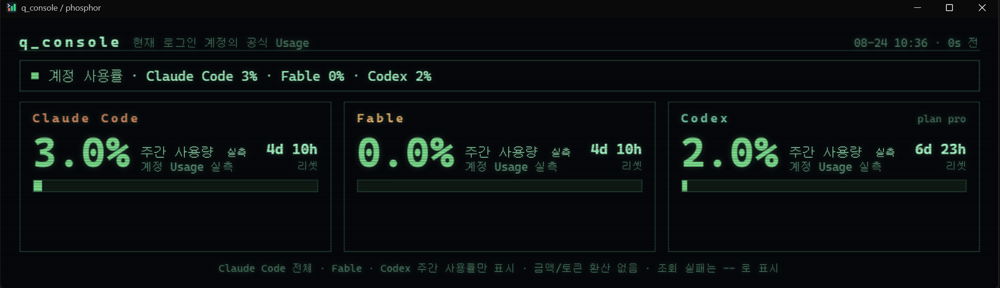
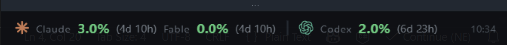

# q_console

Windows 트레이/오버레이로 **Claude Code · Fable · Codex 계정의 주간 사용률**을 보여주는 작은 도구입니다.

A tiny Windows tray/overlay app that shows the **weekly account usage** of Claude Code, Fable, and Codex.



오버레이는 화면 구석에 한 줄로 붙어 있습니다:



표시하는 것은 세 가지뿐입니다:

| 항목 | 출처 |
|---|---|
| Claude Code | Claude Usage의 All models 주간 사용률 |
| Fable | Claude Usage의 Fable 전용 주간 사용률 |
| Codex | ChatGPT Usage의 Weekly usage limit |

금액, 공개 단가 환산, 로컬 토큰 합계, 5시간 창은 표시하지 않습니다.

## 설치 / 실행

### 빌드된 EXE (권장)

[Releases](../../releases)에서 `q_console-windows-x64.zip`을 받아 압축을 풀고 `q_console.exe`를 더블클릭하면 트레이 + 우측 하단 오버레이로 실행됩니다.

```
q_console.exe --open                 트레이 + 대시보드 창 바로 열기
q_console.exe --install-autostart    Windows 시작 시 자동 실행
q_console.exe --uninstall-autostart
q_console.exe --install-startmenu
```

### 소스 실행 (Python 3.10+)

```
q_console.cmd            트레이만 (콘솔 창 없음)
q_console.cmd --open     트레이 + 대시보드
q_console.cmd --print    텍스트 사용률 출력
```

트레이 아이콘 **좌클릭 = 대시보드**, **우클릭 = Refresh / Theme / Overlay / Always on Top / Exit**.
30분마다 자동 갱신하며 Refresh를 누르면 즉시 다시 조회합니다. 첫 실행 기본값은 Overlay ON입니다.

## 데이터 기준

세 값 모두 로컬 로그 추정치가 아니라, 설치된 클라이언트가 사용하는 **읽기 전용 계정 Usage 응답값**입니다.

- **Claude / Fable**: `~/.claude/.credentials.json`의 현재 Claude Code 로그인을 이용해 Anthropic 계정 Usage를 조회합니다. weekly_all과 Fable weekly_scoped를 각각 별도 퍼센트로 표시합니다.
- **Codex**: `~/.codex/auth.json`의 현재 ChatGPT 로그인을 이용해 Codex 계정 Usage의 7일 창을 조회합니다.

q_console은 두 자격 증명 파일을 **읽기만** 합니다. 토큰을 config/cache/html에 저장하지 않고, 자격 증명 갱신도 하지 않습니다. Claude Code 또는 Codex 앱이 로그인을 갱신하면 다음 Refresh가 새 자격 증명을 읽습니다.

네트워크/로그인 문제로 현재 값을 확인할 수 없으면 오래된 값을 유지하지 않고 `--`로 표시합니다. 0%는 서버가 실제로 0을 반환했을 때만 표시합니다.

## 화면

대시보드에는 Claude Code / Fable / Codex 카드 세 개가 있고, 각 카드에 현재 주간 사용률 %, 리셋까지 남은 시간, 실측 배지가 표시됩니다. 오버레이는 한 줄로 세 사용률과 리셋 잔여 시간을 보여줍니다. (위 스크린샷 참고)

테마: `Surfacer` / `HUD (phosphor)` / `Mini`.

## 문제 해결

- **값이 `--`**: 해당 앱에서 로그아웃됐거나 네트워크 조회 실패. 앱 로그인 후 Refresh.
- **창이 안 뜨고 텍스트 창만**: [WebView2 런타임](https://developer.microsoft.com/microsoft-edge/webview2/) 설치.
- **오버레이가 비어 있음**: 트레이 우클릭 → Refresh 후 Overlay를 다시 선택.

## 빌드

```
pip install pyinstaller
pyinstaller q_console.spec
```

`dist/q_console.exe`가 생성됩니다.

## 구조

```
q_console.cmd           소스 실행 런처
q_console.spec          EXE 빌드 정의 (PyInstaller)
core/plan_usage.py      Claude/Fable/Codex 현재 계정 Usage 조회
core/snapshot.py        세 퍼센트용 화면 모델
core/render.py          대시보드 / Mini / Overlay 렌더
core/config.py, util.py
ui/                     트레이(PowerShell) + WebView2 호스트
```

설정과 캐시는 `%LOCALAPPDATA%\q_console`에만 기록합니다.

## License

[MIT](LICENSE)
