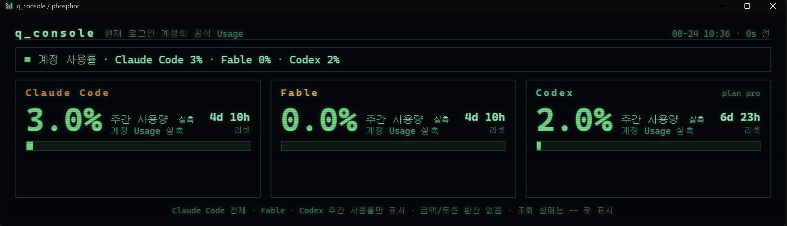

# q_console

Windows 트레이/오버레이로 **Claude의 주간·5시간 사용률과 Fable / Codex의 주간 사용률**을 보여주는 작은 도구입니다.

A tiny Windows tray/overlay app showing Claude's **weekly and five-hour session usage**, plus Fable and Codex weekly usage.



오버레이는 화면 구석에 한 줄로 붙어 있습니다. 아래는 실제 계정에서 주간·5시간 사용량을 수신한 화면입니다:


계정에 따라 다음 항목을 표시함:

| 항목 | 출처 |
|---|---|
| Claude Code | Claude Usage의 All models 주간 사용률, 현재 세션(5시간) 사용률 및 각각의 재설정 시간 |
| Claude Enterprise | 사용량 기반 Enterprise 계정의 월간 실측 금액, 실제 한도, 사용률 |
| Fable | Claude Usage의 Fable 전용 주간 사용률 |
| Codex | ChatGPT Usage의 Weekly usage limit, 보유 리셋권 |

구독 계정의 사용률은 계정 Usage 응답에서 읽습니다. Claude의 현재 세션은 5시간 창이며 주간 한도와 별도로 재설정됩니다.
단, 사용량 기반 Claude Enterprise는 계정 Usage가 반환한 월간 금액과 실제 한도를 표시함.
Enterprise에서 한도를 제공하지 않으면 금액만 표시하며, 별도 Fable 사용률이 없으면 `--`로 표시함.
(구독 없이 **API 키**로 쓰는 경우에는 표시할 플랜 한도가 없으므로, 대신 이번 달 사용량을
직접 정한 예산과 비교해 보여줍니다. → [API 키 모드](#api-키-모드))

## 설치 / 실행

### 빌드된 EXE (권장)

[Releases](../../releases)에서 `q_console-windows-x64.zip`을 받아 압축을 풀고 `q_console.exe`를 더블클릭하면 트레이 + 우측 하단 오버레이로 실행됩니다.

```
q_console.exe --open                 트레이 + 대시보드 창 바로 열기
q_console.exe --install-autostart    Windows 시작 시 자동 실행
q_console.exe --uninstall-autostart
q_console.exe --install-startmenu
q_console.exe --install-webview2     WebView2 런타임 설치 재시도 (보통 불필요)
```

첫 실행 때 이 PC에 **WebView2 런타임이 없으면** Microsoft 공식 부트스트래퍼를
내려받아 조용히(관리자 권한 없이, 사용자 단위로) 한 번 설치합니다. 다운로드는 서명을
검사한 뒤에만 실행하고, 시도 여부를 `%LOCALAPPDATA%\q_console\webview2-install.json`에
기록해 매 실행마다 반복하지 않습니다. 런타임이 이미 있으면 아무것도 하지 않습니다.

### 소스 실행 (Python 3.10+)

```
q_console.bat            트레이만 (콘솔 창 없음)
q_console.bat --open     트레이 + 대시보드
q_console.bat --print    텍스트 사용률 출력
```

트레이 아이콘 **좌클릭 = 대시보드**, **우클릭 = Refresh / Theme / Overlay / Always on Top / Exit**.
1분마다 자동 갱신하며 Refresh를 누르면 다시 조회합니다. Claude가 요청 제한(HTTP 429)을 반환하면 서버의 `Retry-After` 동안 대기합니다. 별도 안내가 없으면 5분부터 최대 30분까지 재시도 간격을 늘립니다. 대기 중에도 Codex와 화면은 갱신됩니다. 첫 실행 기본값은 Overlay ON입니다.
트레이 우클릭 → **Overlay 표시 항목**에서 Claude / Fable / Codex / 시계를 각각 켜고 끌 수 있습니다.
선택은 재시작 후에도 유지되며, 표시하는 항목에 맞춰 오버레이 폭이 줄어듭니다. 최소 한 항목은 켜 두어야 합니다.
오버레이는 항상 위에 표시되며, 다른 최상위 창에 가려지거나 최소화·숨김 상태가 되면 1초 주기로 자동 복구합니다.
작업 중인 창의 포커스와 오버레이 위치를 유지하고, 작업 표시줄 미리 보기(Peek) 중에도 흐려지지 않도록 설정합니다.

## 데이터 기준

세 값 모두 로컬 로그 추정치가 아니라, 설치된 클라이언트가 사용하는 **읽기 전용 계정 Usage 응답값**입니다.

- **Claude / Fable**: `~/.claude/.credentials.json`의 현재 Claude Code 로그인을 이용해 Anthropic 계정 Usage를 조회합니다. weekly_all, 현재 세션 session(기존 응답의 five_hour), Fable weekly_scoped를 각각 별도 퍼센트로 표시합니다. 현재 세션이 0%여도 표시하며, 조회 실패로 값이 없으면 `5h --`로 남겨 두고 툴팁에서 실패 이유를 보여줍니다.
- **Claude Enterprise**: Enterprise 로그인을 자동 인식하고, 주간 한도가 없는 사용량 기반 계정은 `spend`의 금액·통화·소수점 단위 또는 기존 `extra_usage` 응답을 읽어 월간 사용량으로 표시함. 공개 API 단가로 환산하거나 로컬 예산을 계정 한도로 대신 표시하지 않음.
- **Codex**: `~/.codex/auth.json`의 현재 ChatGPT 로그인을 이용해 Codex 계정 Usage의 7일 창을 조회합니다.
- **Codex 리셋권**: 웹 Usage의 사용 가능 목록과 같은 `rate_limit_reset_credits.available_count`의 보유 개수를 `리셋권 2개`처럼 표시함. 별도 `applicable_available_count`가 0이어도 보유 리셋권은 표시함. 조회 실패·값 미제공은 0개 대신 `--`로 표시함. 리셋권을 사용하지 않음.
- **Codex 리셋권 만료**: 리셋권이 1개 이상이면 조회 전용 `wham/rate-limit-reset-credits`에서 리셋권별 `expires_at`을 읽어, 리셋권 문구에 마우스를 올리면 만료 시각과 남은 기간을 툴팁으로 보여줌. `/consume`은 호출하지 않음.
- **Claude 리셋권**: Claude Code의 `/limit-reset`과 같은 `api/oauth/usage?cedar_ember=1` 응답의 `grants`에서 `usable_now`가 참이고 일시 중지되지 않은 리셋권의 `resets_left`만 합산해 `리셋권 1개`처럼 표시함. 툴팁에도 사용할 수 있는 리셋권의 전체/5시간 구분과 만료 시각만 보여줌. 사용량과 같은 요청 하나로 읽으므로 조회 횟수는 늘지 않음. 서버가 Claude Code 클라이언트에만 리셋권을 알려 주므로 설치된 Claude Code 버전으로 `claude-cli/<버전> (external, cli)` User-Agent를 보냄(config의 `claude_cli_version`으로 지정 가능). 리셋권을 사용하지 않으며, 리셋권 대상이 아닌 계정은 줄을 숨기고 조회 실패는 `--`로 표시함.

토큰은 config/cache/html에 저장하지 않습니다. Claude 액세스 토큰이 만료됐거나 만료까지 1분 이내이면 기존 refresh token으로 자동 갱신하고, Claude Code의 자격 증명 파일에만 원자적으로 저장합니다. 기존 로그인 범위와 다른 필드를 유지하며, 조회 중 Claude Code가 로그인이나 계정을 바꿨으면 그 변경을 보존합니다. 만료 시각과 관계없이 HTTP 401이 발생한 경우에도 한 번 갱신 후 재조회합니다. Codex 자격 증명 파일은 읽기만 합니다.

자동 로그인 갱신 후에도 조회에 실패하면 **직전 실측값을 유지**하고 `*`와 흐린 색으로
표시합니다. 값이 더 이상 참일 수 없게 되면 - 그 주간 창이 이미 리셋됐거나 24시간
(`stale_max_age_sec`)이 지나면 - 유지하지 않고 `--`로 돌아갑니다. 만료된 Claude 토큰은
사용량 조회의 요청 제한 대기보다 먼저 갱신합니다. 사용량 서버가 만료 토큰에 HTTP 401 대신 429를 반환하는 경우도 처리합니다. 0%는 서버가 실제로 0을 반환했을
때만 표시합니다.

## API 키 모드

구독 로그인이 없고 **API 키**(`ANTHROPIC_API_KEY` / `ANTHROPIC_AUTH_TOKEN` 환경변수 또는
Claude Code `settings.json`의 `env`, Codex는 `~/.codex/auth.json`의 `OPENAI_API_KEY`)만
있으면 자동으로 이 모드로 전환됩니다. API 키에는 "주간 플랜 몇 %" 같은 값이 존재하지
않기 때문에, 대신 **이번 달(달력 기준) 사용량 ÷ 내가 정한 예산**을 퍼센트로 보여줍니다.

| 항목 | 단위 | 출처 |
|---|---|---|
| Claude Code / Fable | USD | 이 PC의 `~/.claude/projects` 세션 로그를 공개 단가로 환산 |
| Codex | 토큰 | 이 PC의 `~/.codex/sessions` 롤아웃 토큰 합계 |

```
q_console.exe --set-budget claude=250          월 예산 250 USD
q_console.exe --set-budget codex=3000000000    월 예산 30억 토큰
q_console.exe --set-usage-mode api_key         자동 감지 대신 강제 (auto|subscription|api_key)
```

- 예산을 0으로 두면 퍼센트 대신 `--`가 뜹니다(없는 기준으로 비율을 지어내지 않습니다).
  실제 사용량 금액/토큰은 예산과 무관하게 카드에 항상 표시됩니다.
- Codex를 달러가 아닌 토큰으로 보여주는 이유: q_console에는 OpenAI 단가표가 없고,
  없는 단가를 추측해 금액처럼 적으면 그건 사실이 아니라 추정입니다.
- **조직 Admin 키**(`sk-ant-admin01-...`)를 `ANTHROPIC_ADMIN_KEY` 환경변수(권장) 또는
  설정의 `anthropic_admin_key`에 두면, 로컬 로그 환산 대신 Anthropic
  [Cost API](https://platform.claude.com/docs/en/manage-claude/usage-cost-api)의 **실제
  청구액**을 사용합니다. 이 키는 조직 계정에서만 발급되며 개인 계정에는 없습니다.
  실패하면 조용히 로컬 로그 환산으로 되돌아갑니다.
- 로컬 로그 환산은 **이 PC의 CLI 작업만** 봅니다. 다른 기기나 다른 앱에서 같은 키로 쓴
  API 호출은 포함되지 않습니다(그건 Admin 키 경로에서만 보입니다).

## 화면

대시보드에는 Claude Code / Fable / Codex 카드 세 개가 있고, 각 카드에 주간 사용률 %, 재설정까지 남은 시간, 실측 배지가 표시됩니다. Claude 카드에는 현재 세션(5시간)도 표시됩니다. 오버레이는 `Claude 주간 29% (…) 5h 2.0% (…)`처럼 두 창의 사용률과 각 재설정 잔여 시간을 구분합니다. Claude 표시를 끄면 5시간 항목도 함께 숨깁니다. (위 스크린샷 참고)
Enterprise 로그인에서는 Claude 카드가 `Claude Enterprise`로 바뀌며, 월간 실측 금액·한도·사용률이 대시보드, Mini, 오버레이에 표시됨. Codex 리셋권도 세 화면에 함께 표시됨.
서버가 Enterprise 리셋 시각을 제공하지 않으면 임의의 카운트다운을 만들지 않고 `--`로 표시함. 이전 월의 금액은 새 월에 재사용하지 않음.

테마: `Surfacer` / `HUD (phosphor)` / `Mini`.

## 문제 해결

- **값이 `--`**: 해당 앱에서 로그아웃됐거나 네트워크 조회 실패. 앱 로그인 후 Refresh.
- **값에 `*`가 붙음**: 이번 조회가 실패해 직전 실측값을 유지 중입니다. Claude 토큰은 자동 갱신합니다. 갱신도 실패하면 Claude Code에서 다시 로그인한 뒤 Refresh합니다.
- **주간 값은 있는데 `5h --`**: 이전 캐시에 주간 값만 있고 현재 조회가 실패한 상태일 수 있습니다. `5h`에 마우스를 올려 원인을 확인합니다. 요청 제한이면 `조회 대기`를 표시하며 자동 재조회까지 기다립니다. 5시간 값은 해당 세션 재설정 이후에는 이전 값을 유지하지 않습니다.
- **창이 안 뜨고 텍스트 창만**: WebView2 런타임 자동 설치가 실패한 경우입니다.
  `q_console.exe --install-webview2`로 재시도하거나
  [수동 설치](https://developer.microsoft.com/microsoft-edge/webview2/).
- **오버레이가 비어 있음**: 트레이 우클릭 → Refresh 후 Overlay를 다시 선택.

## 빌드

```
pip install pyinstaller
pyinstaller q_console.spec
```

`dist/q_console.exe`가 생성됩니다.

## 구조

```
q_console.bat           소스 실행 런처
q_console.spec          EXE 빌드 정의 (PyInstaller)
core/plan_usage.py      Claude/Fable/Codex 현재 계정 Usage 조회 (구독)
core/api_key_usage.py   API 키 모드: 이번 달 사용량 vs 예산
core/claude_code.py     ~/.claude/projects 세션 로그 파서 (단가 환산)
core/codex.py           ~/.codex/sessions 롤아웃 파서 (토큰)
core/bootstrap.py       첫 실행 WebView2 런타임 자동 설치 (1회)
core/snapshot.py        세 퍼센트용 화면 모델
core/render.py          대시보드 / Mini / Overlay 렌더
core/config.py, util.py
ui/                     트레이(PowerShell) + WebView2 호스트
```

설정과 캐시는 `%LOCALAPPDATA%\q_console`에만 기록합니다.

## License

[MIT](LICENSE)
